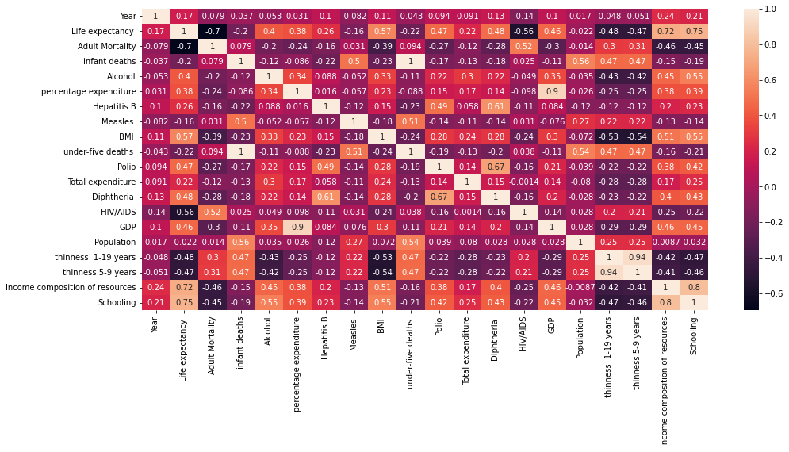
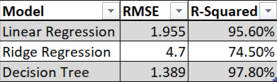
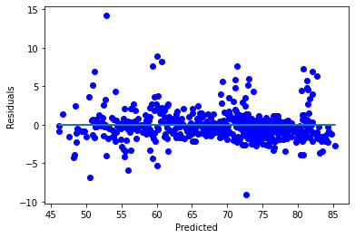
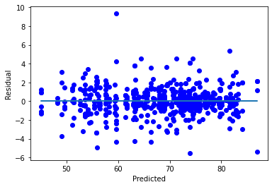
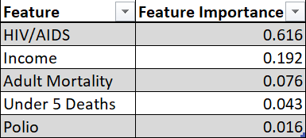

# Predicting Countries' Life Expectancy using Immunization Related, Mortality, Economical, and Social Factors

 

Badge [source](https://shields.io/)

## Key findings

Countries with highest HIV/AIDS prevalence and lowest income are the most likely to have the lowest life expectancy. 

## Authors

- [@siyamabu](https://www.github.com/siyamabu)

**Language and Tools:** 
* Python :snake:
* Jupyter Notebook :notebook:
* GitHub :heart_eyes:

**Libraries used:** 
* Pandas
* Scikit-learn
* Numpy
* Matplotlib
* Seaborn

**Environments Used:** 
* Windows 10 🪟

## Table of Contents

  - [Motivation](#motivation)
  - [Data source](#data-source)
  - [Methods](#methods)
  - [Quick Glance at the Results](#quick-glance-at-the-results)
  - [Lessons Learned and Recommendations](#lessons-learned-and-recommendations)
  - [Limitations and What Can Be Improved](#limitations-and-what-can-be-improved)
  - [Explore the Notebook](#explore-the-notebook)
  - [License](#license)

## Motivation 

Being born and raised in a developing country with a high mortality rate evoked my interest in understanding the factors contributing towards its low life expectancy. There is no better indicator of a country's social development than having a long and healthy life. However, what are the population conditions limiting this?

## Data Source

- [Life Expectancy (WHO)](https://www.kaggle.com/datasets/kumarajarshi/life-expectancy-who)

## Dataset Description

The dataset is related to life expectancy. Health factors for 193 countries have been collected from the same WHO data repository website and its corresponding economic data was collected from United Nation website. Among all categories of health-related factors only those critical factors were chosen which are more representative. The dataset consists of 22 Columns and 2938 rows. The predictor variables are divided into several broad categories: immunization related factors, mortality factors, economical factors and social factors.

## Methods

1. Exploratory Data Analysis
    * Historgrams of each quantitative feature and an assessment of correlations between pairs of quantitative features. 
    * Value counts table of each qualitative feature. 
2. Data Cleaning
    * An analysis on the extent of missing values for each feature coupled with a missing value imputation using the median. 
    * Transformation of highly skewed quanitative features. 
    * One-Hot encoding of qualitative features. 
3. Linear Regression
    * First Model using transformed and one-hot encode features.
    * Second Model where the transformed features are standardized and polynomial features with degree=2 are added. 
    * 5 Fold Cross Validation.
4. Ridge Regression
    * One model using the transformed standardized features with polynomial features with degree=2 added.
5. Decision Tree Regressor
   * First Tree using max_depth=5 and min_samples_leaf=5.
   * Second Tree using GridSearchCV to find a more optimal tree.
   * 5 Fold Cross Validation.

## Quick Glance at the Results

Correlations between variables.

A comparison of the best results from each model.

The Residuals vs Predicted Strength for the best linear regression model.

 

The Observed Strength vs Predicted Strength for the best linear regression model.

The Residuals vs Predicted Strength for the best decision tree regression model. 

The Observed Strength vs Predicted Strength for the best decision tree regression model.

5 highest feature importance scores from the best decision tree model.

 

## Lessons Learned and Recommendations
- HIV/AIDs and Income Composition are the most significant predictors of life expectancy. This elicits the importance of alleviating HIV/AIDs as well as equitably distributing income in efforts centered around improving life expectancy. 
- Schooling had the highest correlation with life expectancy. This means we can expect region areas with higher levels of schooling to have higher life expectancies. 
- Efforts towards improving life expectancy need to focus on alleviating fatal diseases such as HIV/AIDs. These efforts are made more effective by equitably distibuting income which provides more people with access to healthcare, medicine, and schooling.

## Limitations and What Can Be Improved
- There are other numerous factors impacting life expectancy not included in this examination. (wars, accidents, other diseases e.g, cancer)
- The predictions can be improved by including these features. 

## Explore the Notebook

To explore the notebook file [here](https://github.com/siyamabu/Life-Expectancy/blob/main/life_expectancy_prediction.ipynb)

## License

MIT License

Copyright (c) 2022 Siyabonga Mabuza

Permission is hereby granted, free of charge, to any person obtaining a copy
of this software and associated documentation files (the "Software"), to deal
in the Software without restriction, including without limitation the rights
to use, copy, modify, merge, publish, distribute, sublicense, and/or sell
copies of the Software, and to permit persons to whom the Software is
furnished to do so, subject to the following conditions:

The above copyright notice and this permission notice shall be included in all
copies or substantial portions of the Software.

THE SOFTWARE IS PROVIDED "AS IS", WITHOUT WARRANTY OF ANY KIND, EXPRESS OR
IMPLIED, INCLUDING BUT NOT LIMITED TO THE WARRANTIES OF MERCHANTABILITY,
FITNESS FOR A PARTICULAR PURPOSE AND NONINFRINGEMENT. IN NO EVENT SHALL THE
AUTHORS OR COPYRIGHT HOLDERS BE LIABLE FOR ANY CLAIM, DAMAGES OR OTHER
LIABILITY, WHETHER IN AN ACTION OF CONTRACT, TORT OR OTHERWISE, ARISING FROM,
OUT OF OR IN CONNECTION WITH THE SOFTWARE OR THE USE OR OTHER DEALINGS IN THE
SOFTWARE.

Learn more about [MIT](https://choosealicense.com/licenses/mit/) license

